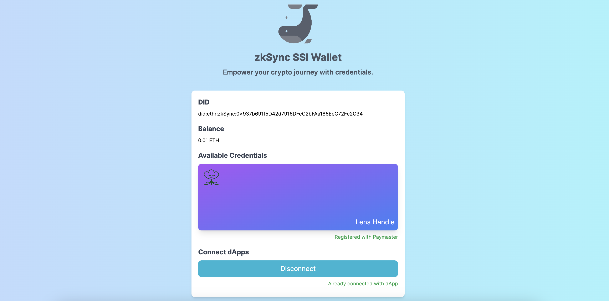
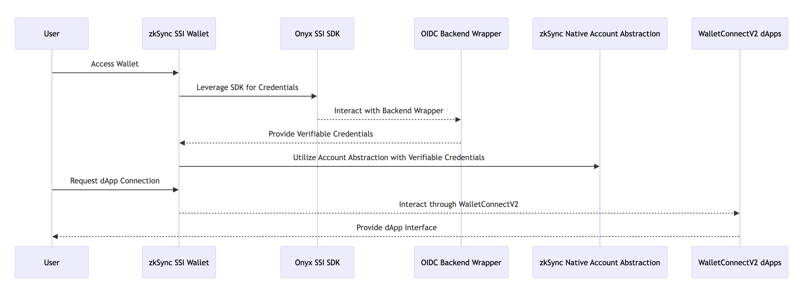

# zkSync SSI Wallet

Empower your crypto journey with credentials.

## Submission

### Live App

https://zksync-ssi-wallet.vercel.app/

### Demo Video

https://youtu.be/N9ZmKLimwgA

### Pitch Deck

https://docs.google.com/presentation/d/14qkSPo9HErHtMgp_-2Eb4tWKg41dzi20tqEYvk9KXqw/edit?usp=sharing

## Description

zkSync SSI Wallet is a simple-to-use, web-based wallet. It uses Onyx SSI SDK, the Lens Protocol, and zkSync Account Abstraction features to provide users a seamless and feature-rich experience. A standout feature is its ability to help users save on transaction costs with its innovative gas system.

## How it Works

- **Integration of Onyx SSI SDK with Onyx OIDC Wrapper:** zkSync SSI Wallet leverages the Onyx SSI SDK and integrates it with a smooth OIDC system. This combination allows for the issuance, holding, and verification of verifiable credentials directly within the frontend wallet application.

- **Lens Protocol Implementation:** The wallet integrates the Lens Protocol, which allows users to access and manage their social data seamlessly. This feature enhances user experience by providing valuable insights and functionalities based on the user's social data.

- **zkSync Native Account Abstraction:** At its core, the wallet uses zkSync's native Account Abstraction, which allows it to process the extra information present in the verifiable credentials created via Onyx SSI SDK.

