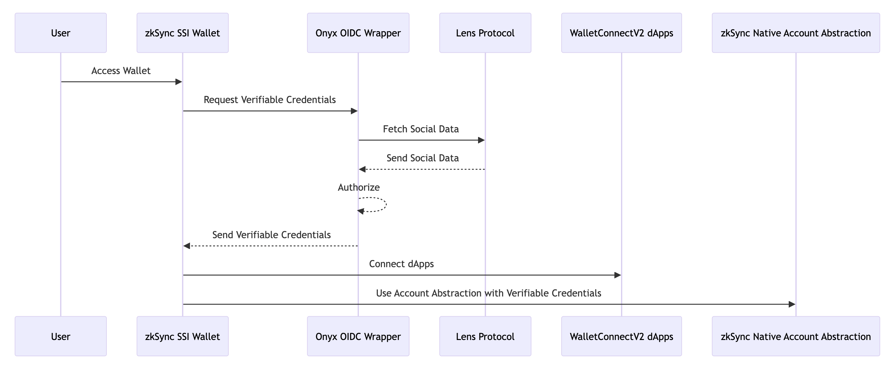

# zkSync SSI Wallet

## Description

zkSync SSI Wallet is a simple-to-use, web-based wallet. It uses Onyx SSI SDK and zkSync features to give users a smooth experience. A special feature is that it helps users save on transaction costs with its unique gas system.

## How it Works

- **Integration of Onyx SSI SDK with OIDC Backend Wrapper:** zkSync SSI Wallet leverages the Onyx SSI SDK and integrates it with a smooth backend OIDC system. This combination allows for the issuance, holding, and verification of verifiable credentials directly within the frontend wallet application.

- **zkSync Native Account Abstraction:** At its core, the wallet uses zkSync's native Account Abstraction, which allows it to process the extra information present in the verifiable credentials created via Onyx SSI SDK.

- **WalletConnectV2 Compatibility:** The wallet app is adeptly designed to establish seamless interactions with other dApps via WalletConnectV2.

## Key Benefits

zkSync SSI Wallet stands at the technological vanguard, offering its users a set of unique advantages:

1. **Unified Credential Management and Security**: Through the integration of the Onyx SSI SDK with the OIDC Backend Wrapper, the wallet facilitates seamless credential issuance, holding, and verification. When paired with zkSync's native Account Abstraction, it guarantees premium security for both credentials and assets.

2. **Optimized Transactions and Cost Efficiency**: The wallet's specialized credential-based gas sponsoring system, combined with zkSync's inherent capabilities, ensures that users experience faster, more dependable transactions that are also cost-effective.

3. **Seamless Integration with the Decentralized Ecosystem**: With WalletConnectV2 Compatibility, the wallet effortlessly connects to a diverse array of dApps. Its browser-based architecture further amplifies this benefit, offering unmatched flexibility and a wide-ranging footprint in the decentralized landscape.
